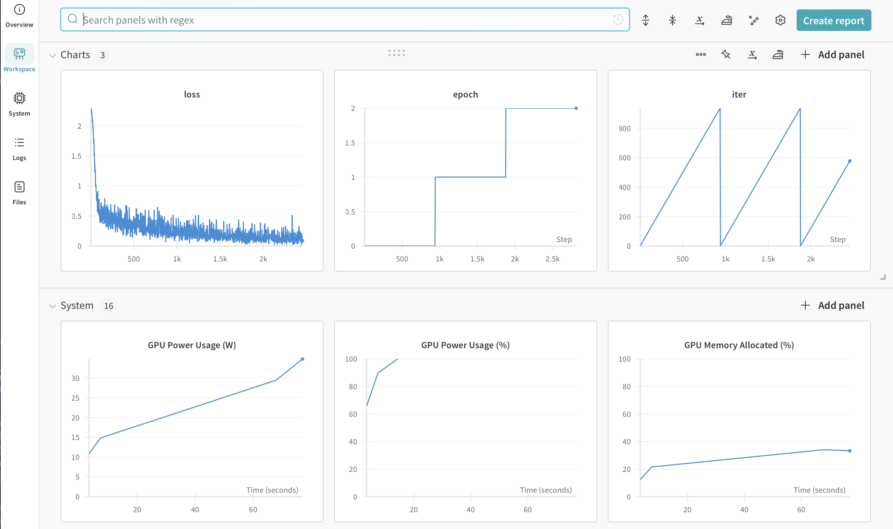
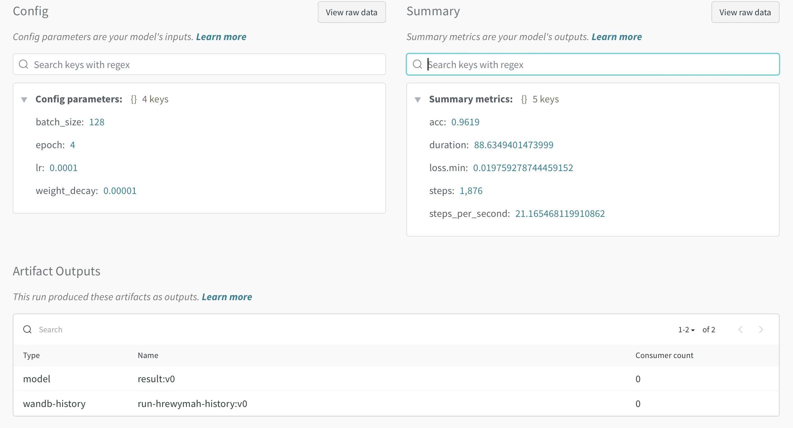
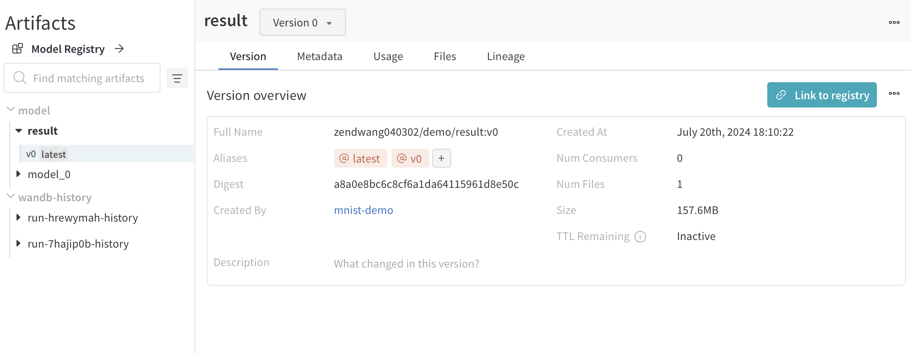
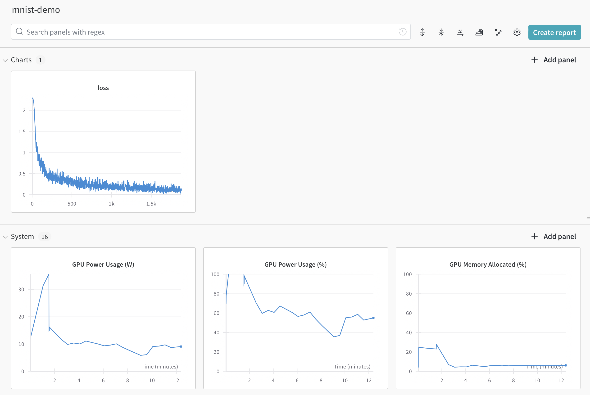

# Training Monitor with Wandb

## Introduction

Before actually introducing any specific acceleration tools, we first presents a tool to monitor the training process.

The most artless way to do so is to print, which is inefficient, slow, bad for the eyes and not very informative. Tensor Board, the monitor tool for TensorFlow, is a good choice, but it is not very convenient to use with PyTorch, albeit there is a PyTorch version of it.

Currently, wandb, aka weights and bias, works the best for PyTorch. It is easy to use, flexible, informative, and has a good UI. It is also free to use, which is a big plus. However, the downside is that it requires an account, which is a cost for being a centralized platform.

## Construct a Model

This project uses a model for MNIST classification. 

```python
class MnistModel(nn.Module):
    
    def __init__(
        self,
        x_len: int = 28,
    ):
        # Convulsion + Attention
        super(MnistModel, self).__init__()
        # [batch, channel, x_len, x_len] -> [batch, channel, x_len, x_len]
        self.conv = nn.Conv2d(
            in_channels=1, out_channels=32, kernel_size=3, stride=1, padding=1
        )
        self.relu = nn.ReLU()
        # [batch, channel, x_len, x_len] -> [batch, channel, x_len/2, x_len/2]
        self.maxpool1 = nn.MaxPool2d(kernel_size=2, stride=2)
        self.conv2 = nn.Conv2d(
            in_channels=32, out_channels=64, kernel_size=3, stride=1, padding=1
        )
        # [batch, channel, x_len/2, x_len/2] -> [batch, channel, x_len/4, x_len/4]
        self.maxpool2 = nn.MaxPool2d(kernel_size=2, stride=2)
        # [batch, channel, l, l] -> [batch, channel, l * l]
        self.flatten_before_attn = nn.Flatten(start_dim=-2)
        # [batch, channel, l * l] -> [batch, channel, l * l]
        self.attn = nn.MultiheadAttention(
            embed_dim=(x_len // 4) ** 2, num_heads=1, batch_first=True
        )
        # [batch, channel, l * l] -> [batch, channel * l * l]
        self.flatten_after_attn = nn.Flatten(start_dim=-2)
        flattened_last_dim = 64 * (x_len // 4) ** 2
        self.fc1 = nn.Linear(flattened_last_dim, flattened_last_dim * 2)
        self.activation1 = nn.ReLU()
        self.fc2 = nn.Linear(flattened_last_dim * 2, flattened_last_dim)
        self.activation2 = nn.ReLU()
        self.fc3 = nn.Linear(flattened_last_dim * 2, 10)
    
    def forward(self, x):
        x = self.conv(x)
        x = self.relu(x)
        x = self.maxpool1(x)
        x = self.conv2(x)
        x = self.relu(x)
        x = self.maxpool2(x)
        x = self.flatten_before_attn(x)
        x, _ = self.attn(x, x, x)
        x = self.flatten_after_attn(x)
        x = self.fc1(x)
        x = self.activation1(x)
        x = self.fc2(x)
        x = self.activation2(x)
        x = self.fc3(x)
        return x
```

## Working with Wandb

### Before Training

Before training, you should install wandb, and login with either command `wandb login` or calling `wandb.login()` in the code. This only needs to be done once per computer.

First, use the init function to create a run. In wandb, you can create multiple projects, each project containing several runs. Adding tags is also supported for searching.

It is suggested that you put the hyper parameters in the wandb configuration to view it on the panel.

```python
wandb.init(
    project="demo",
    name="mnist-demo",
    tags=["demo"],
    config={
        "lr": 1e-4,
        "epoch": 3,
        "batch_size": 64,
        "weight_decay": 1e-5
    }
)
```

### In Training

#### Casual Logging

In training, just log anything you'd like to check with `wandb.log`, loss especially.

```python
loss_fn = nn.CrossEntropyLoss()
for ep in range(wandb.config.epoch):
    for idx, (x, y) in enumerate(train_loader):
        x, y = x.to(device), y.to(device)
        optim.zero_grad()
        y_pred = model(x)
        loss = loss_fn(y_pred, y)
        loss.backward()
        optim.step()
        wandb.log({"loss": loss.item(), "epoch": ep, "iter": idx})
```

Then you can spontaneously view the infos on the wandb panel. By click the project, the run, a pleasantly arranged board will be available like this,



Below will introduce some commonly used logging techniques. However, that's not all of them.

#### Logging Plot and Table

Or you can specify the plot type. 

To create a plot, you must first create a wandb table. 

```python
data = [[x, y] for (x, y) in zip(x_values, y_values)]
table = wandb.Table(data=data, columns=["x", "y"])
```

You can also use pandas data frame instead of list.

In addition, table can also contain other types of data, like images. You can use `Image` function to create that and view later on the dash board.

Then a plot can be created from the table, like,

```python
wandb.log(
    {
        "custom_plot_id": wandb.plot.line(
            table, "x", "y", title="Custom Y vs X Line Plot"
        )
    }
)
```

Of course, you can directly log a table,

```python
wandb.log(
    {
        "custom_table_id": wandb.Table(data=data, columns=["x", "y"])
    }
)
```

#### Logging Metrics

If you do evaluation during training, you might be interested in their statistical representations, like mean, minimum value, and so on, instead of solely a plot.

You can define a metric like,

```python
wandb.define_metric("loss", summary="min")
```

Then just log as usual, and you will also have their respective statistic numbers. However, the key must be the same.

#### Logging Model

In addition, you can also log model for checkpoints,

```python
torch.save(model.state_dict(), f"model_{ep}.pth")
wandb.log_model(path=f"model_{ep}.pth", name=f"model_{ep}")
```

Later you can use it as,

```python
run = wandb.init(project="project_name")
downloaded_model_path = run.use_model(name="model_name")
```

#### Logging Files

Wandb can log Files, especially datasets with Artifact logging, just use it as,

```python
iris_table_artifact = wandb.Artifact("iris_artifact", type="dataset")
iris_table_artifact.add(iris_table, "iris_table")
iris_table_artifact.add_file("iris.csv")
run = wandb.init(project="tables-walkthrough")
run.log_artifact(iris_table_artifact)
```

Although directly logging a table is allowed, logging as artifact has an increased row capacity.

### After training

After training, you'd always want testing. If testing metrics is desired to be stored, you'd typically put that in the wandb summary, like,

```python
wandb.summary["acc"] = correct / total
```

After everything is done, call `wandb.finish()` to finish this run.

Of course, summary can be accessed anytime after the creation of wandb run. You can also put things like running time, steps per seconds to it.

## Finished Dashboard






